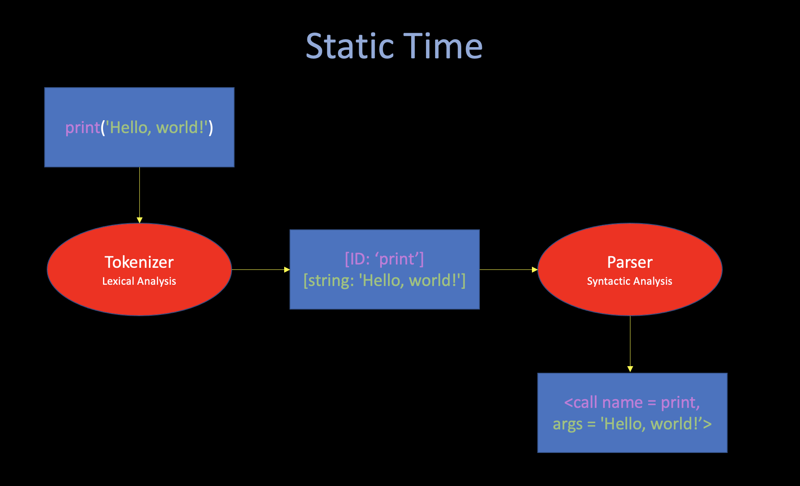
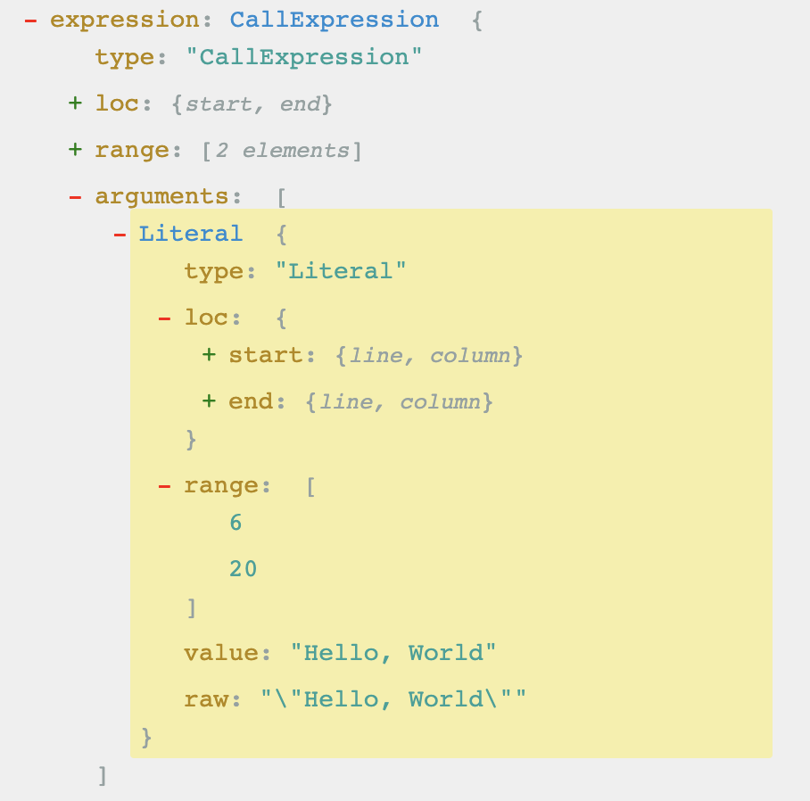
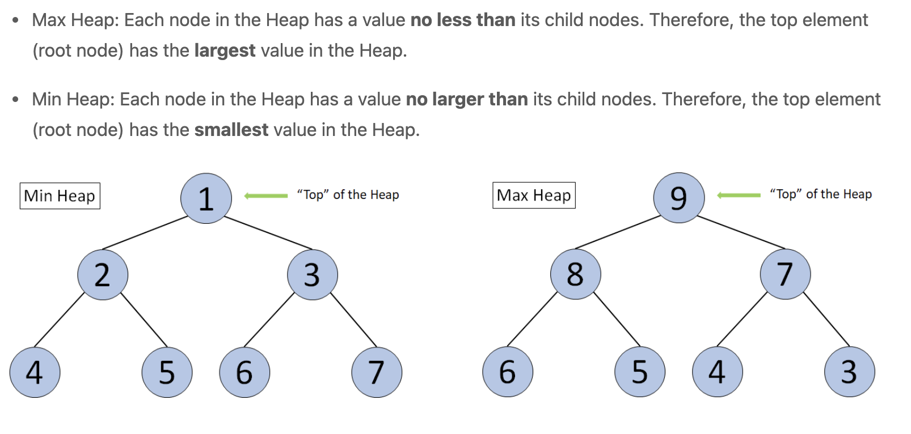
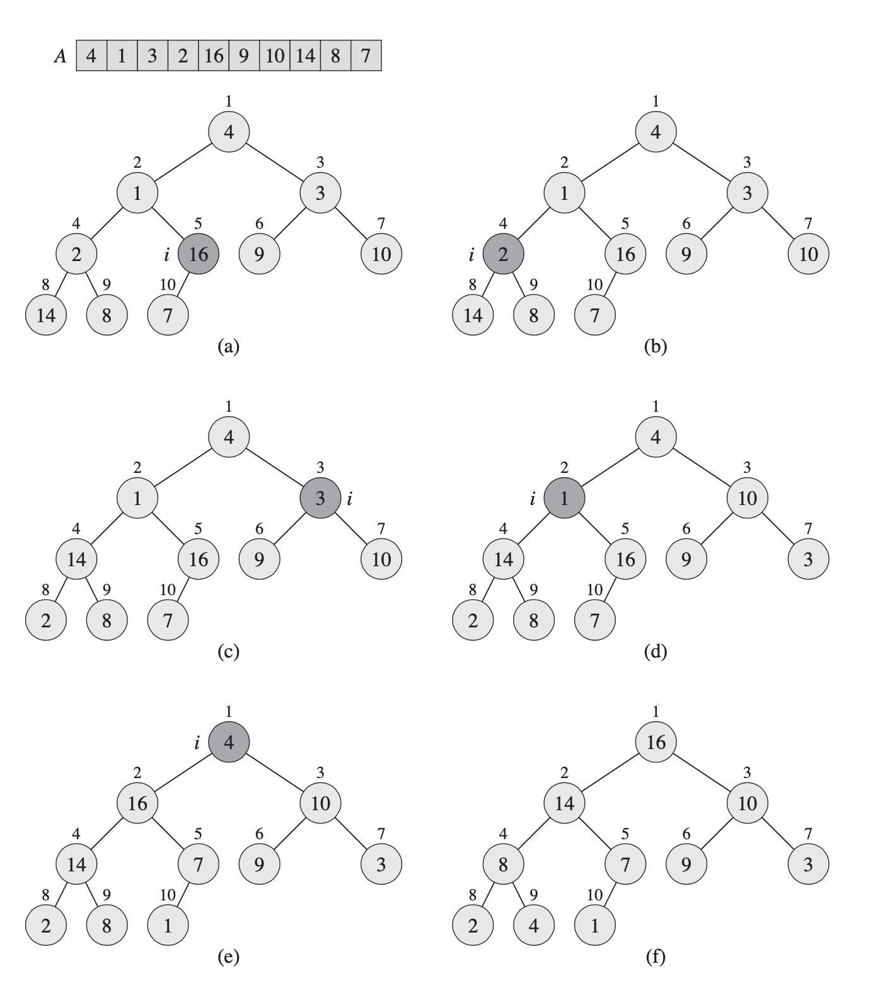
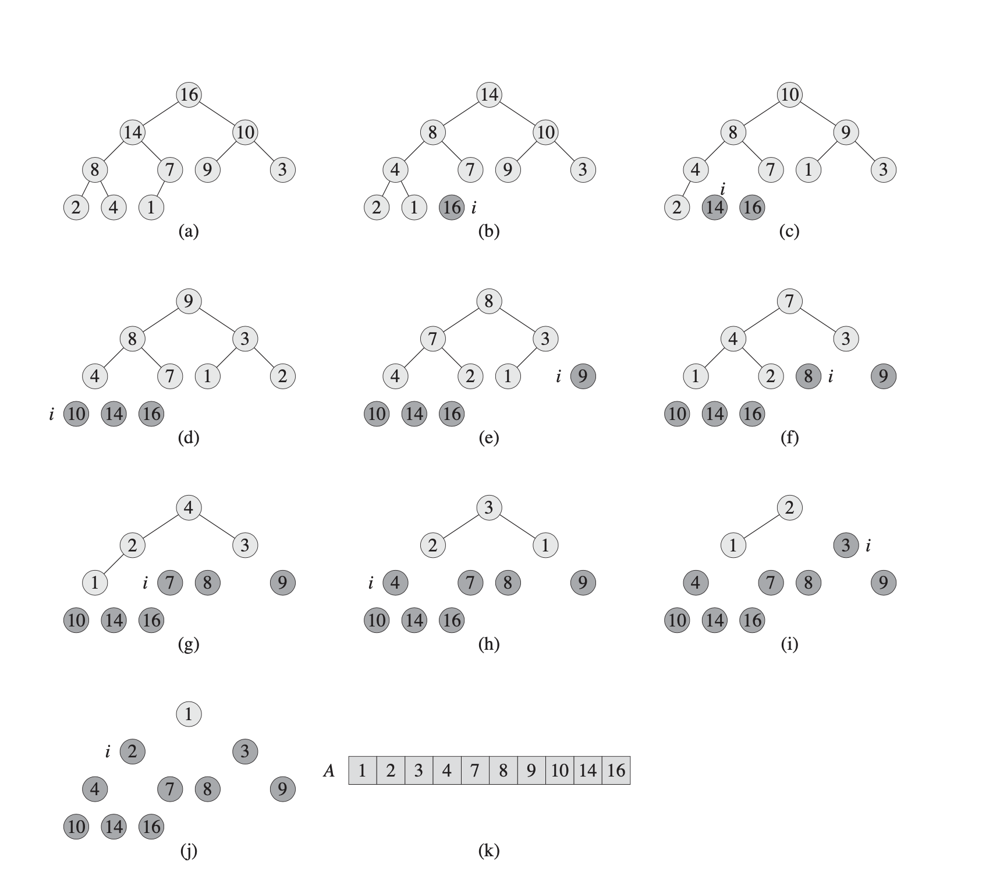

# Angorithm4 Webinar #5

#### Host by Jiawei Wang 2021-11-19

## 1. Review Interpreter vs. Compiler

### i. Interpreter == Virtual Machine


* **There is no "Interpreted language" or "Compiled language"**
* **Just layer-by-layer interpret (running in the Virtual machine)**
* **Interpret means just update the state of this machine (Turing Machine)**
* **Finally interprete at the real-machine --> CPU**

### ii. Static Time 




### iii. Runtime


* ### 1. Stack-based VM

```
                 # stack contents (leftmost = top = most recent):
 push A          #           A
 push B          #     B     A
 push C          # C   B     A
 subtract        #     B-C   A
 multiply        #           A*(B-C)
 push D          #     D     A*(B-C)
 push E          # E   D     A*(B-C)
 add             #     D+E   A*(B-C)
 add             #           A*(B-C)+(D+E)
```
```java
public class JavaBytecode {
    public static void main(String[] args) {
	int x = 15;
	System.out.println(x + 10 - 5);
    }
};
```
```
Compiled from "JavaBytecode.java"
public class JavaBytecode {
  public JavaBytecode();
    Code:
       0: aload_0
       1: invokespecial #1                  // Method java/lang/Object."<init>":()V
       4: return

  public static void main(java.lang.String[]);
    Code:
       0: bipush        15
       2: istore_1
       3: getstatic     #7                  // Field java/lang/System.out:Ljava/io/PrintStream;
       6: iload_1
       7: bipush        10
       9: iadd
      10: iconst_5
      11: isub
      12: invokevirtual #13                 // Method java/io/PrintStream.println:(I)V
      15: return
}
```

* ### 2. Register-based VM (Real-CPU)

```c
#include <stdio.h>

int main() {
    int x = 15;
    printf("%i", x);
}

```
```asm
	.section	__TEXT,__text,regular,pure_instructions
	.build_version macos, 11, 0	sdk_version 12, 0
	.globl	_main                           ## -- Begin function main
	.p2align	4, 0x90
_main:                                  ## @main
	.cfi_startproc
## %bb.0:
	pushq	%rbp
	.cfi_def_cfa_offset 16
	.cfi_offset %rbp, -16
	movq	%rsp, %rbp
	.cfi_def_cfa_register %rbp
	subq	$16, %rsp
	movl	$15, -4(%rbp)
	movl	-4(%rbp), %esi
	leaq	L_.str(%rip), %rdi
	movb	$0, %al
	callq	_printf
	xorl	%eax, %eax
	addq	$16, %rsp
	popq	%rbp
	retq
	.cfi_endproc
                                        ## -- End function
	.section	__TEXT,__cstring,cstring_literals
L_.str:                                 ## @.str
	.asciz	"%i"

.subsections_via_symbols
```

### The Deeper, the faster!


## 2. Comparision Sort(III) - Heap Sort

### i. Heap
* **Heap is a special "Piority Queue"**
* **Heap is a Complete Binary Tree**
* The value of each node must be **no greater than (or no less than)** the value of its child nodes.



```cpp
void MaxHeaptify(vector<int>& A, int root, int length) {
    // complete binary tree
    int left = 2*root;
    int right = 2*root + 1;

    int largest;

    if (left <= length && A[left] > A[root]) {
        largest = left;
    } else {
        largest = root;
    }

    if (right <= length && A[right] > A[largest]) {
        largest = right;
    }

    if (largest != root) {
        // we need to update the subtree
        swap(A[root], A[largest]);
        MaxHeaptify(A, largest, length);
    }
}

void BuildMaxHeap(vector<int>& A) {
    // from the last parent node to root
    for (int i = (int)A.size()/2; i >= 1; i--) {
        MaxHeaptify(A, i, (int)A.size()-1);
    }
}
```



### ii. Heap Sort

```cpp
void HeapSort(vector<int>& A) {
    A.insert(A.begin(), 0);
    BuildMaxHeap(A);

    int size = (int)A.size() - 1;
    for (int i = (int)A.size()-1; i >= 2; i--) {
        swap(A[1], A[i]);
        size--; // key
        MaxHeaptify(A, 1, size);
    }
    A.erase(A.begin());
}


```



### iii. Time Complexity Analysis

* #### Worse-case analysis:
    * **`BuildMaxHeap()`** -- O(N)
    * **`MaxHeaptify()`**  -- O(logN) (h)
    * **`HeapSort()`**     -- O(NlogN)


### iv. Application (Example)

* **[LeetCode 215. Kth Largest Element in an Array](https://leetcode.com/problems/kth-largest-element-in-an-array/)**

```cpp
class Solution {
    public int findKthLargest(int[] nums, int k) {
        // init heap 'the smallest element first'
        PriorityQueue<Integer> heap =
            new PriorityQueue<Integer>((n1, n2) -> n1 - n2);

        // keep k largest elements in the heap
        for (int n: nums) {
          heap.add(n);
          if (heap.size() > k)
            heap.poll();
        }

        // output
        return heap.poll();        
  }
}
```


## 3. Lower Bounds of Comparision Sort

### 1. Is O(NlogN) the best we can do?

**`N! <= 2^h` ->`h >= log(N!)` >= log(N/e)^N = Nlog(N/e) = NlogN - Nloge**<br>
= **O`(NlogN)`**


### 2. Theoretically Fastest (Which One?)


