# Angorithm4 Webinar #9

##### Host By Jiawei Wang 2021-12-17

## 1.angorithm4.org Dev Process

> Redesign a brand-new **light** index page, Hope you like it :)

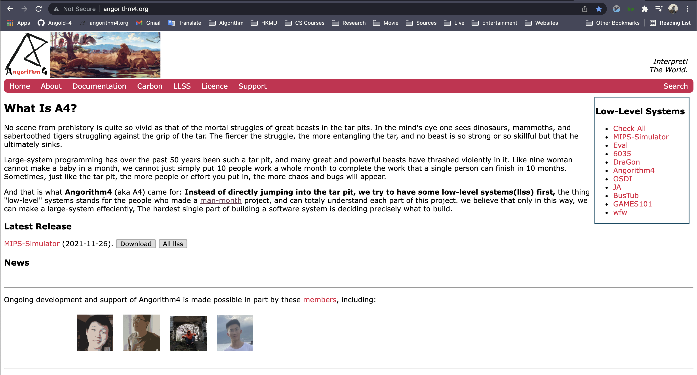

* [x] **Domain Register (USD 7.99/YR)**
* [x] **Web Server Basic (Apache httpd2, Ubuntu)**
* [x] **Server Language (php, C++)**
* [x] **Index Page Design (Custom CSS with Bootstrap)**
* [x] **Database (Sqlite)**
* [ ] **Applications (Online Docker) (Chat Room)**
* [ ] **User-friendly features (md -> html)** 
* [ ] **Personal Page, information, and other pages (Webinar, Projects...)**
* [ ]........

### Future Plan 

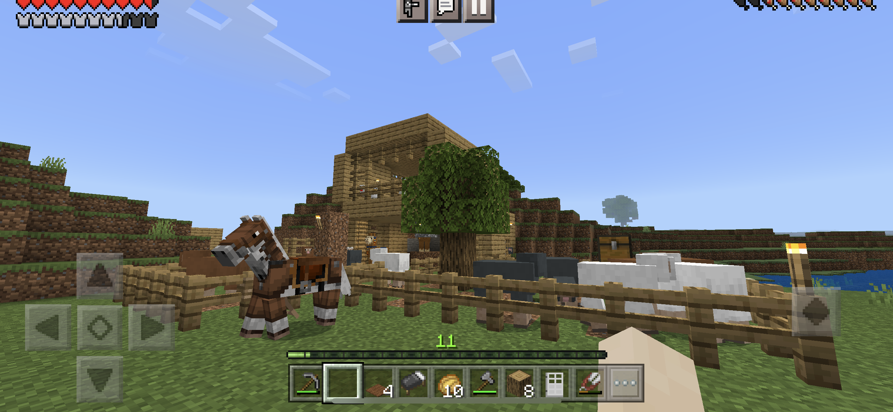
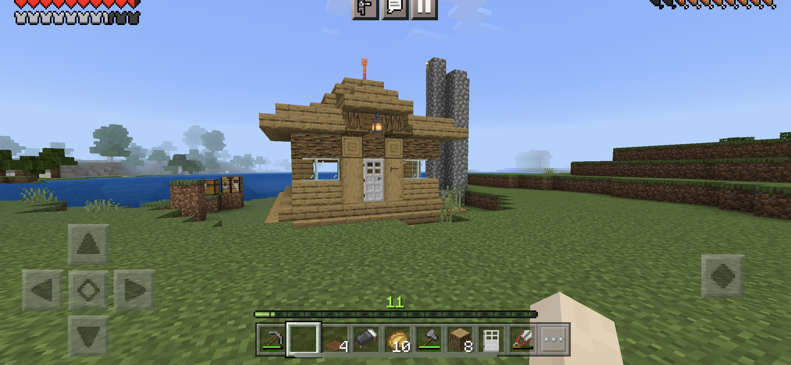
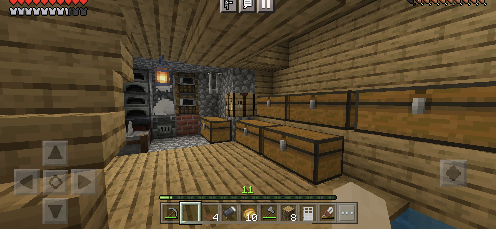
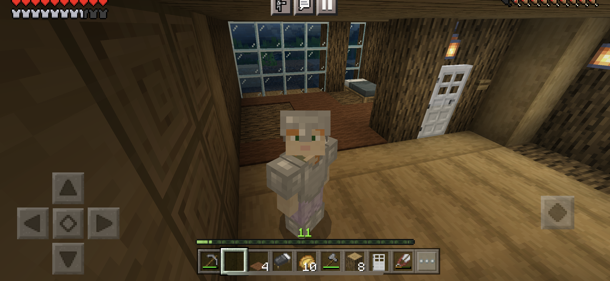

### [Minecraft in a Weekend](https://github.com/jdah/minecraft-weekend)

## 2. Hashing (Part II)

### i. Revision: Buffer Pool
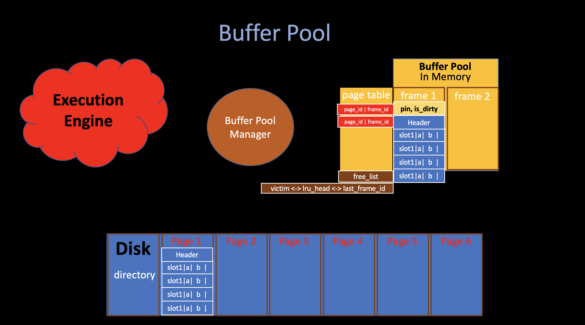

### ii. Revision: Linear Probe Hashing (Static Hashing)
* Static Assumption: **You know the number of elements ahead of time.**
* Cost More Storiage but Faster **(Handle Collision)** Vs Cost Less Storiage but Slower**(Wide Hash Function)**

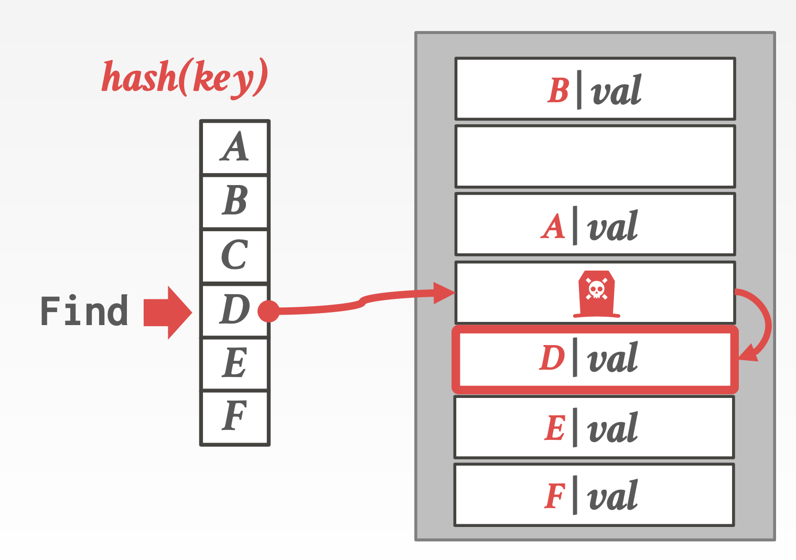

If we hash into a slot and we find something that’s already there, I’m trying to insert something there. 
We just keep scanning down to the next position and keep going **until we find the first open slot**

### iii. Dynamic Hashing

* The previous hash tables require the DBMS to know the **number of elements it wants to store.**

**Otherwise it has rebuild the table if it needs to grow/shrink in size.**

**`unordered_map`?**

#### Example

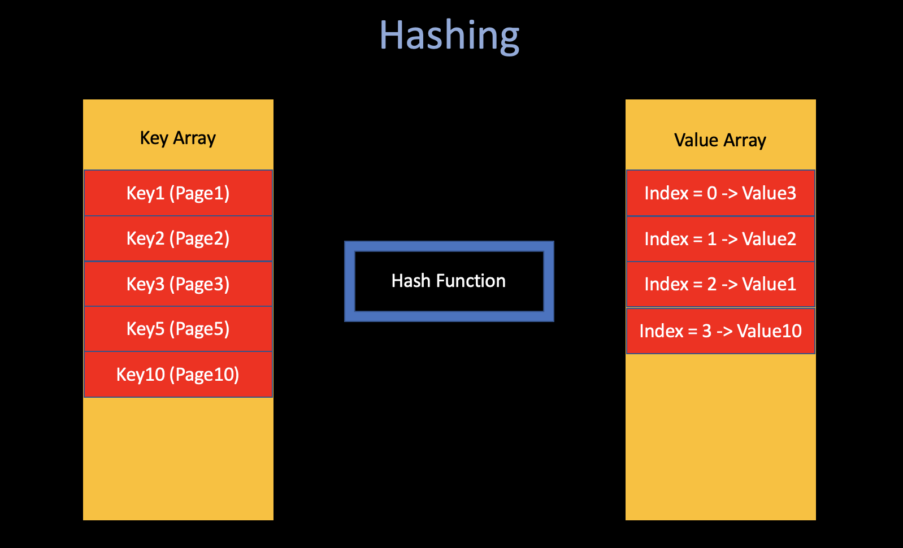

#### 1) Chained Hashing (Used in Java)

Maintain a linked list of buckets for each slot in the hash table. 
**Resolve collisions by placing all elements with the same hash key into the same bucket.**

* Similar to Linear Probe Hashing

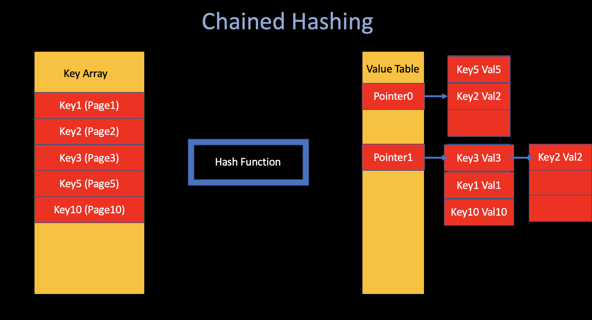

#### 2) Extendible Hashing

* **[Very Good Explianation](https://www.youtube.com/watch?v=HcVyagxx_b4)**

> "**Only Split the chain when overflowed**"

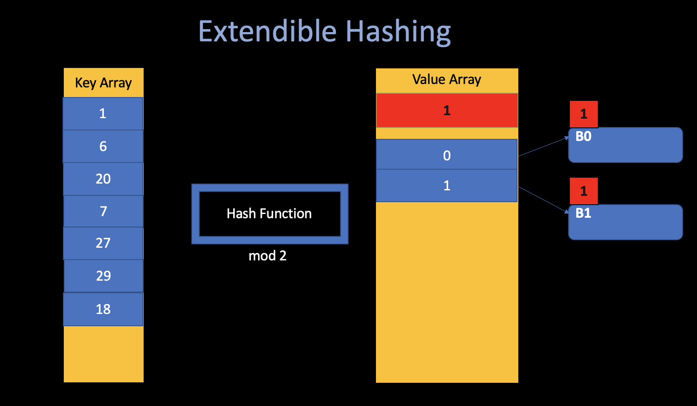

#### 3) Linear Hashing

> "**Two Hash Functions**"

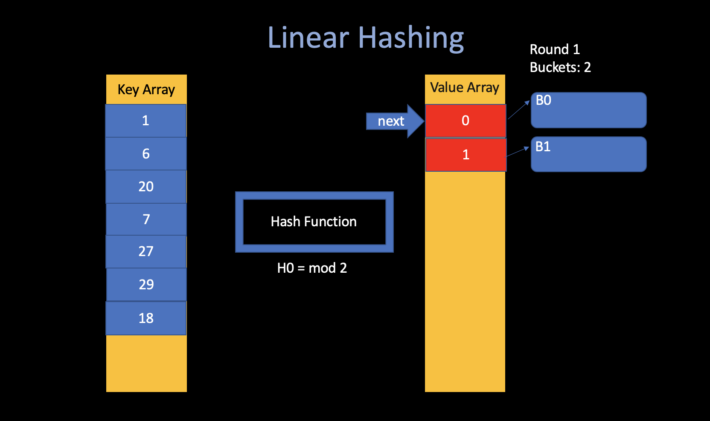

