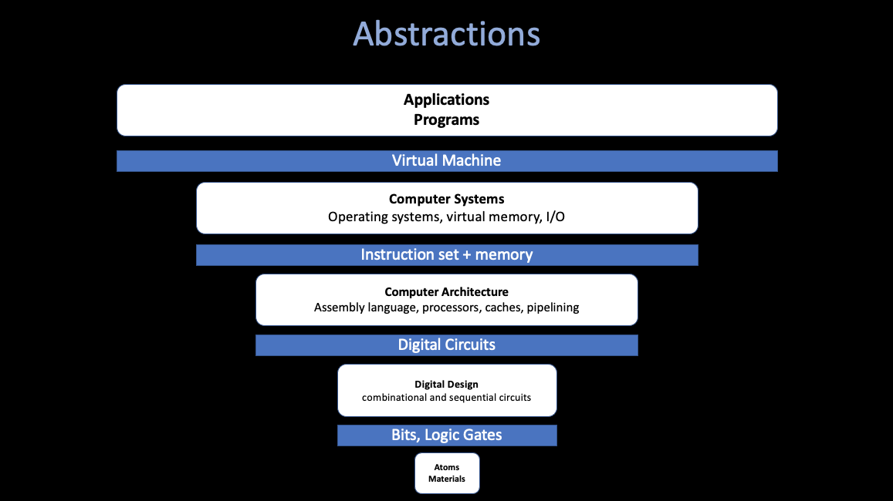
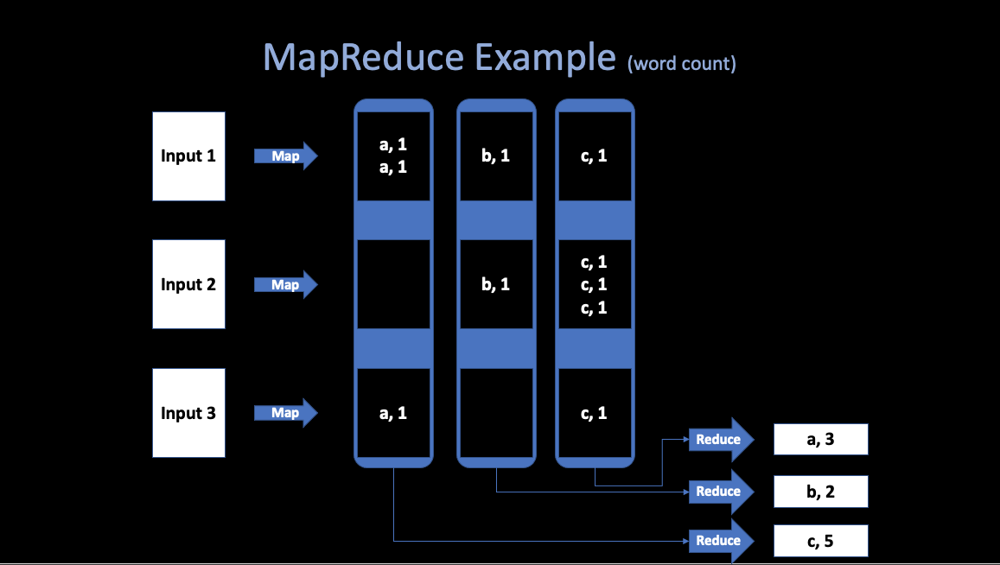

## A4 Spring 2022 Webinar Series

# 1. MapReduce
##### Host By Angold Wang 02/25/2022

### Prologue: The Power of Abstraction



**These Abstractions let us reason about the behavior of our building blocks, without understanding the implementation details underneath.**

## Thread

* **IO concurrency**
    * While some threads are waiting for I/O, other threads can utilize the CPU resources.
* **Parallelism**
    * Execute code in parallel on several cores.
* **Convinence**
    * Relatively simple to programming


### User

* **Most User:** Do not aware / care.
* **Computer Enthusiast (Geek):** Intel Core i7-12700K, 12 Cores / 20 Threads.
* **Some Programmers:** Thread vs. Process.


### Programming Language

* **User-level Threads `(N:M)`**\*
    * The kernel is **not aware** of the existence of these threads.
    * These threads are usually inside 1 or more process, managed by the **Thread Scheduler** of the programming language itself.
    * Example: **Golang: `goroutine`.**
* **Kernel-level Threads `(1:1)`**
    * Kernel Scheduling Entity (KSE)
    * The **minimum-executable** unit in the machine.
    * Managed by the **OS Scheduler**
    * Example: **C: `pthread`, Java: `java.lang.Thread`, C++ `std::thread`**.
 
> **Thread implementation in Golang - Goroutine**


* Each **goroutine** is an independent unit of execution, which have its **unique stack**.
* Go's runtime uses resizable, bounded stacks, initially of only 2KB/goroutine. (the runtime grows and shrinks).
* **Work-stealing** scheduling algorithm.

### Operating Systems
#### Threads and Processes are the same !
#### They are all KSEs, and the OS manage them through the OS Scheduler.


## 1. Distributed Systems

### i. What a Distributed System is?
A set of cooperating computers that are communicating with each other over network to get some conherent task done.

* **Storiage for big websites**
* **Big data computations (MapReduce)**
* **...**

### ii. Why People Need a Distributed System?

Usually, the high-level goal of building a distributed system is to get **scalable speed-up**.

1. **"More" Data and Computations**
2. **Scalability**
    * **2x computers -> 2x throughput (huge win)**
    * **Parallelism:** Split the computations into multiple machines. (MapReduce)
    * **High-throughput:** Split the request data into pieces and read them conrurrently from different servers (GFS).
3. Phsical Reason
4. Security / Isolated

### iii. Challenges

1. **Fault Tolerate.**
    * Big distributed systems: **Failure problems just happen all the time !**
    * The failure has to be built into the design.
    * **Recoverability**
2. **Achieve this Scalability.** (not infinite)
3. **Build the Interface.**
    * The **"Abstraction"**.
    * We'd love to be able to build interfaces that look and act just like non-distributed storage and computation systems, but are actually with vast and extremely high performance fault tolerant distributed systems underneath.

4. **Consistency**
    * How to make **Replicas** consistent.
    * Communication problem (Weak and Strong consistency)


## 2. MapReduce

### i. Overview
**Back to 2004, engineers in Google were were looking for a framework that would make it easy for non-specialists to be able to write and run giant distributed computations.**

* Analysis Crawled Documents
* Build a index of the web
* Sort Web requests logs
* ...

* ****

* **Multi-hour Computations**
* **Multi-terabyte Datasets**
* **Multi-thousand Machines** 


* ****


* How to parallelize the computations ?
* How to distribute the data ? 
* How to handle failures ?


### ii. Programming Model
**In a programmer's view, the computation recieves many files, and takes a set of input key/value pairs, then produces a set of output key/value pairs.**

#### Example: word count


#### Map
* Written by the User.
* Recieve input files and then produces a set of output key/value pairs.
* MR calls `map(k, v)` for each input file `k`, and its contains `v`, produces set of `k2`, `v2` " intermediate" data.
```javascript
map(String key, String value) {
    // key: document name
    // value: document contents
    for each word w in value:
        Emit(w, "1");
}
```


#### Reduce
* Wirtten by the user.
* Recieve key/value pairs from **`Map`**.
* Then merge together these values with same key to **form a possibly smaller set of values**.
* MR gathers all intermediate `v2` for a given `k2`, and passes each key + values to a reduce call.
* Final outut is set of <k2, v3> pairs from `reduce(k2, v2)`s.
```javascript
reduce(k, v)
    // key: a word
    // value: a list of counts
    int result = 0; 
    for each v in values:
        result += ParseInt(v);
    Emit(AsString(result));
```

#### MapReduce scales well
* N "worker" computers get you Nx throughtput.
* `map`s can run in parallel, since they don't interact. Same for `reduce`s.
* In that way, you can get more throughtput by buying more computers.


## 3. Implementation Details

### i. [Runtime Details (check my notes)](https://a4org.github.io/ds/papers/MapReduce/mapreduce.html):


### ii. RPC MapReduce Implementation


## 4. Practice Performance


